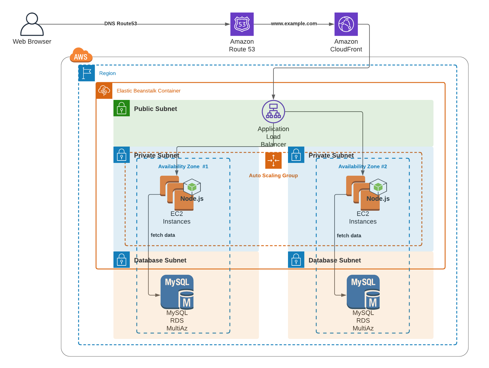

# Apper DevOps Engineer Technical Challenge!  Tier 1

## The Challenge
DevOps in the early stages of their learning journey. Those who are typically experienced deploying user-facing applications such as nodejs apps, ruby web apps, and php laravel apps on virtual machines or in cloud providers such as AWS, GCP, Azure or Heroku. Someone who can leverage ElasticBeanstalk. Also has deep knowledge on Linux Fundamentals and Databases that can leverage AWS RDS for MySQL and PostgreSQL and etc. Basic understanding on AWS basic services such as  VPC, Security Groups, S3, Route53, Cloudfront, Application Load Balancer, EC2 and IAM.  

## System Architecture

## Target to be implemented
* Implement VPC
* Implement RDS
* Implement SecurityGroups
* Implement IAM Roles and Access Policies
* Implement Route53 -> Cloudfront -> Application Loadbalancer -> Elastic Beanstalk Integration and Connectivity (use apperdevops.com)
* Implement Elastic Beanstalk Web Server and RDS Connectivity
* Implement Elastic Beanstalk Custom Config using .ebextensions
* Implement CI/CD to ElasticBeanstalk using AWS CodePipeline. (No manual upload of application zip file.)

